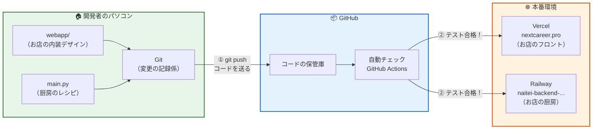
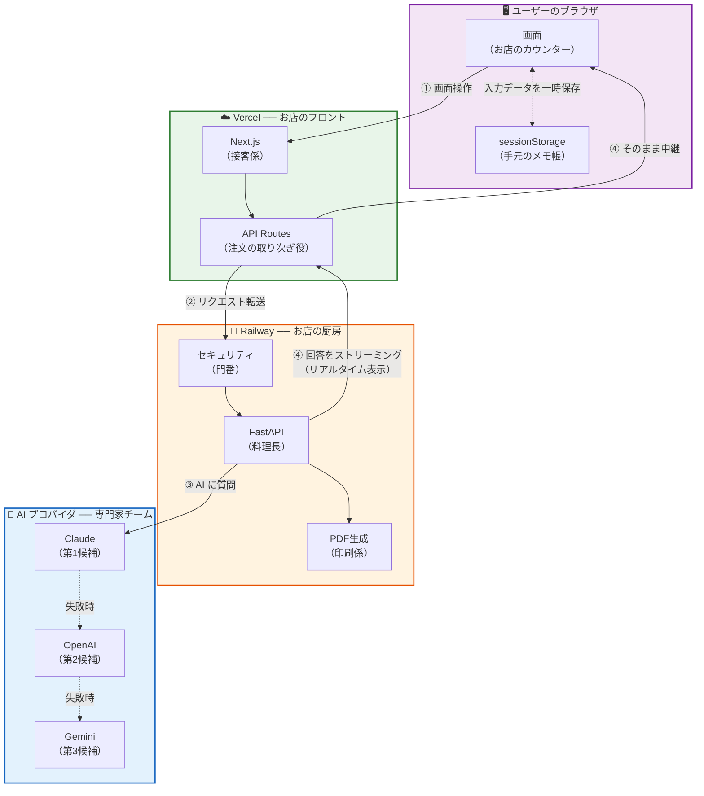
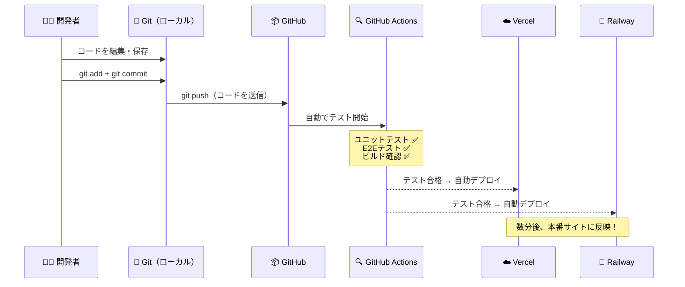
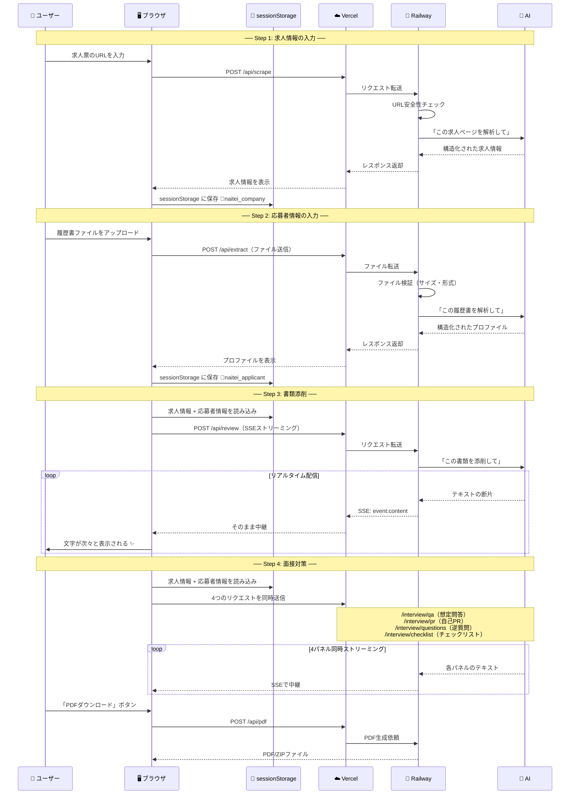
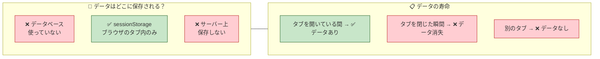
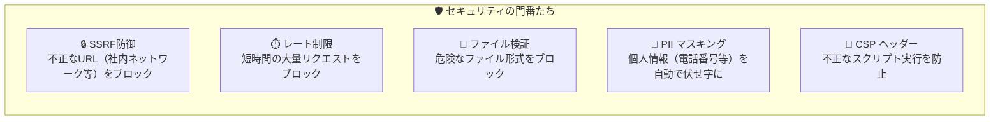

# NextCareer（Naitei.ai）が動く仕組みの地図

> このドキュメントは、エンジニアではない方でも「NextCareer がどう動いているのか」を直感的に理解できるように作成しています。

---

## 1. 全体像：2つの世界

NextCareer には **2つの世界** があります。

| 世界 | 何をするところ？ | 誰が関わる？ |
|---|---|---|
| **開発の世界** | アプリを作って、更新して、公開する | 開発者 |
| **利用の世界** | ユーザーがブラウザでサービスを使う | 一般ユーザー |

この2つの世界を、それぞれ図で説明します。

---

## 2. 開発の世界：「コードが本番に届くまで」

開発者がパソコンでコードを書いてから、ユーザーが使える状態になるまでの流れです。



### この図の読み方

```
開発者のパソコン ──①──> GitHub ──②──> 本番サイト
  コードを書く        保管＆検査      ユーザーが使える！
```

1. 開発者がコードを書き、`git push` で GitHub に送ります
2. GitHub Actions が自動でテスト（品質検査）を実行します
3. テストに合格すると、**Vercel** と **Railway** にそれぞれ自動デプロイされます
4. ユーザーが `https://nextcareer.pro` にアクセスすると、最新版が表示されます

> **ポイント**: 開発者が「公開ボタン」を押す必要はありません。コードを GitHub に送るだけで、自動的に本番サイトが更新されます。

---

## 3. 利用の世界：「ユーザーのデータが流れる道」

ユーザーがブラウザでサービスを使うとき、裏側で何が起きているかの図です。



### この図の読み方

```
ブラウザ ──①──> Vercel ──②──> Railway ──③──> AI
  入力する     ページ配信    処理・判断    文章生成
         <──④── リアルタイムで回答が流れてくる ──④──
```

1. ユーザーが画面でデータを入力します
2. Vercel（接客係）が受け取り、Railway（厨房）に転送します
3. Railway が AI プロバイダに文章生成を依頼します
4. AI の回答がリアルタイムで画面に表示されます（SSE ストリーミング）

---

## 4. 比喩で理解する：各パーツの役割

NextCareer を「レストラン」に例えると、各パーツの役割がわかりやすくなります。

### 🖥️ ブラウザ（sessionStorage）── お客さんの手元メモ

| 項目 | 説明 |
|---|---|
| **役割** | ユーザーが入力した「求人情報」と「応募者プロファイル」を一時的に保存する場所。レストランで例えると、お客さんが自分の注文内容をメモしている紙ナプキンのようなもの。 |
| **重要な特徴** | **データベースは使っていません。** ブラウザのタブを閉じるとデータは消えます。これは設計上の意図的な選択で、個人情報をサーバーに残さないためです。 |
| **保存されるデータ** | `naitei_company`（求人情報）、`naitei_applicant`（応募者情報）の2つだけ |

### ☁️ Vercel（Next.js）── お店のフロント・接客係

| 項目 | 説明 |
|---|---|
| **役割** | ユーザーが見る画面（HTML/CSS/JavaScript）を配信し、ユーザーの操作を受け付ける「接客係」。お店の入口からカウンターまでの空間を担当。 |
| **対応フォルダ** | `webapp/` フォルダ全体（画面デザイン、ボタン、フォームなど） |
| **本番URL** | `https://nextcareer.pro` |
| **もう一つの役割** | 厨房（Railway）への「注文取り次ぎ」も担当。ユーザーのリクエストをそのまま厨房に中継する（API Routes）。 |

### 🔧 Railway（FastAPI）── 厨房・料理長

| 項目 | 説明 |
|---|---|
| **役割** | 実際の「頭脳労働」を行う裏方。AI への質問文の組み立て、ファイルの解析、PDF の生成など、重い処理はすべてここで行う。 |
| **対応ファイル** | `main.py`（1,227行の Python ファイル1つに集約） |
| **本番URL** | `https://naitei-backend-production.up.railway.app` |
| **セキュリティ** | 門番（ミドルウェア）がすべてのリクエストを検査。不正なアクセスやファイルをブロック。 |

### 🤖 AI プロバイダ ── 専門家チーム（3名体制）

| 項目 | 説明 |
|---|---|
| **役割** | 文章の生成・添削・分析を行う外部の専門家。レストランで例えると、特別な食材を仕入れる契約農家のようなもの。 |
| **3名体制** | **Claude**（メイン） → **OpenAI**（バックアップ1） → **Gemini**（バックアップ2）。メインが忙しい・不調のときは自動的に次の候補に切り替わる。 |
| **使用モデル** | Claude: claude-haiku-4-5 / OpenAI: gpt-4o / Gemini: gemini-2.5-flash |

### 📦 GitHub ── 倉庫・品質検査場

| 項目 | 説明 |
|---|---|
| **役割** | すべてのコードの保管場所であり、変更履歴の記録係。さらに、新しいコードが届くたびに自動で品質検査（テスト）を行い、合格したものだけを本番に送り出す。 |
| **対応ファイル** | `.github/workflows/ci.yml`（検査の手順書） |

---

## 5. データの流れ：2つの重要なフロー

### 5.1 フロー A：開発者がコードを更新したとき



> **ポイント**: 開発者は `git push` するだけ。あとは全自動です。

### 5.2 フロー B：ユーザーがサービスを使うとき



### 5.3 データの保存場所（とても重要）



> **なぜデータベースを使わないのか？**
> - 個人情報（履歴書・職歴）をサーバーに保存しない設計です
> - ユーザーのプライバシーを最優先にしています
> - タブを閉じればデータが完全に消えるので、情報漏洩のリスクを最小化しています

---

## 6. セキュリティの仕組み



---

## 7. 重要なURL・パスの対照表

### 7.1 本番URL

| 名称 | URL | 役割 |
|---|---|---|
| **フロントエンド** | `https://nextcareer.pro` | ユーザーがアクセスするサイト |
| **バックエンド** | `https://naitei-backend-production.up.railway.app` | AI処理・PDF生成（ユーザーは直接アクセスしない） |
| **Vercel ダッシュボード** | `https://vercel.com/dashboard` | フロントエンドの管理画面 |
| **Railway ダッシュボード** | `https://railway.app` | バックエンドの管理画面 |

### 7.2 ソースコードの場所と対応先

| ソースコード | 本番での役割 | デプロイ先 |
|---|---|---|
| `webapp/app/page.tsx` | トップページ（ランディング） | Vercel |
| `webapp/app/step1/page.tsx` | Step 1：求人情報入力画面 | Vercel |
| `webapp/app/step2/page.tsx` | Step 2：応募者情報入力画面 | Vercel |
| `webapp/app/step3/page.tsx` | Step 3：書類添削画面 | Vercel |
| `webapp/app/step4/page.tsx` | Step 4：面接対策画面 | Vercel |
| `webapp/app/done/page.tsx` | 完了画面 | Vercel |
| `webapp/app/globals.css` | 全画面の色・フォント・デザイン設定 | Vercel |
| `webapp/app/api/*/route.ts` | バックエンドへの中継役（10ルート） | Vercel |
| `webapp/components/` | 画面部品（ヘッダー、ボタン、ファイルアップロード等） | Vercel |
| `webapp/lib/api-client.ts` | バックエンドとの通信処理 | Vercel |
| `webapp/types/` | データの型定義（求人情報、応募者情報等） | Vercel |
| `main.py` | 全バックエンド処理（AI連携・PDF生成・セキュリティ） | Railway |
| `test_main.py` | バックエンドのテスト | CI のみ |
| `webapp/e2e/golden-path.spec.ts` | 画面操作の自動テスト（30テスト） | CI のみ |
| `.github/workflows/ci.yml` | 自動テスト・デプロイの設定 | GitHub Actions |

### 7.3 画面URLとソースコードの対応

| ブラウザで見るURL | ソースコード | 画面の役割 |
|---|---|---|
| `nextcareer.pro/` | `webapp/app/page.tsx` | トップページ |
| `nextcareer.pro/step1` | `webapp/app/step1/page.tsx` | 求人情報入力 |
| `nextcareer.pro/step2` | `webapp/app/step2/page.tsx` | 応募者情報入力 |
| `nextcareer.pro/step3` | `webapp/app/step3/page.tsx` | 書類添削 |
| `nextcareer.pro/step4` | `webapp/app/step4/page.tsx` | 面接対策 |
| `nextcareer.pro/done` | `webapp/app/done/page.tsx` | 完了 |

---

## 8. よくある質問

### Q. 「Vercel」と「Railway」の2つに分かれているのはなぜ？

**A.** 役割が全く違うからです。

- **Vercel** は「画面の配信」に特化しています。世界中に配信拠点があり、画面表示が高速です。
- **Railway** は「Python の実行」に特化しています。AI との連携や PDF 生成など、重い処理を担当します。

レストランに例えると、お客様が座るホール（Vercel）と、料理を作るキッチン（Railway）を分けているのと同じです。

### Q. AI が3つあるのはなぜ？

**A.** 信頼性のためです。メインの Claude が混雑していたり障害が起きたとき、自動的に OpenAI → Gemini の順に切り替わります。ユーザーは切り替わりに気づきません。

### Q. データベースがないのは大丈夫？

**A.** 意図的な設計です。履歴書や職歴などの個人情報をサーバーに保存しないことで、情報漏洩リスクをゼロにしています。ブラウザのタブを閉じれば、入力データは完全に消えます。
